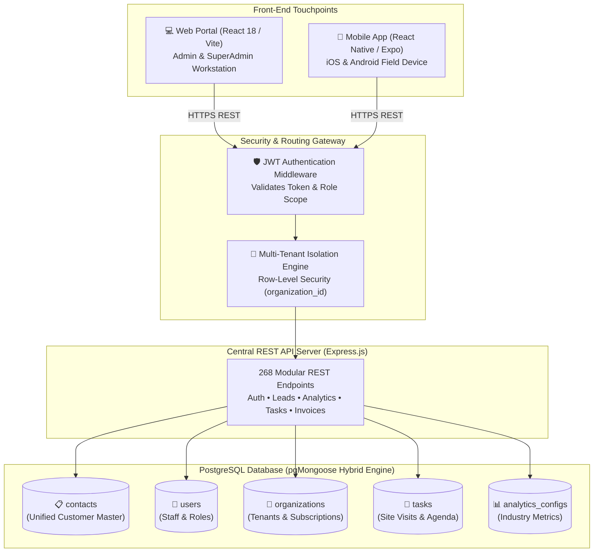
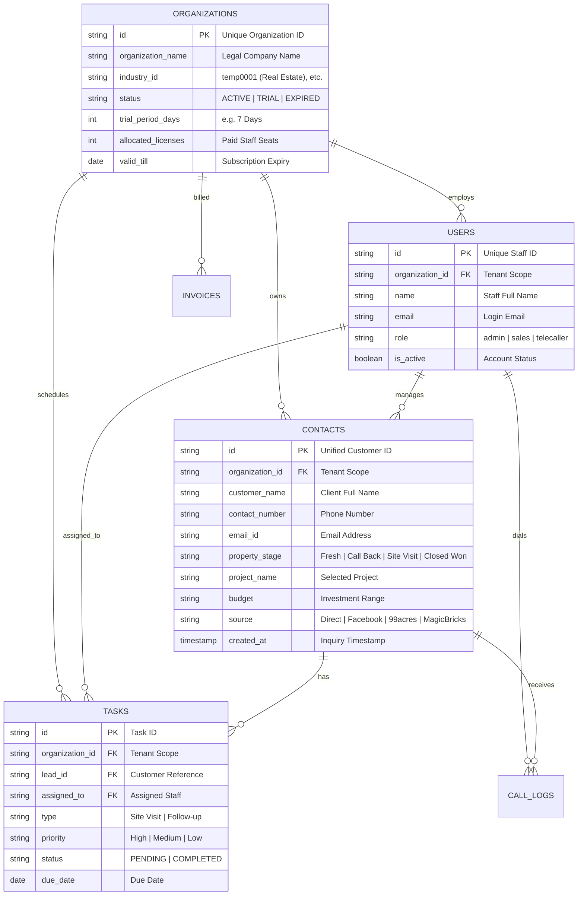

# Leads Rubix CRM: Complete Master API Specification (All 268 Endpoints)

> **Audience**: Designed for executive leadership, investors, clients, and senior engineers.
> **Audit Timestamp**: 2026-09-02T07:19:21.887Z
> **Total Endpoints**: 268 Distinct REST Endpoints
> **Production API Gateway**: https://api1.leadsrubix.com/api
> **Database Engine**: PostgreSQL via pgMongoose (JSONB Hybrid Relational Engine)

---

## 1. Executive Summary & The Layman Analogy

Imagine a busy multi-city enterprise real estate corporate office:
* **The Web Portal (React 18)**: The Desktop Workstation used by Branch Managers, Admins, and Operations teams in the central office.
* **The Mobile App (React Native)**: The Smartphone Handheld Device used by Field Agents, Site Visit Managers, and Telecallers on the move.
* **The 268 REST APIs**: The Digital Messengers connecting both frontends to a single central secure database.
* **The Database (PostgreSQL)**: The Centralized Vault where all customer records, phone calls, site visits, and transactions are permanently stored.

---

## 2. Complete Master API Directory (All 268 Endpoints)

### Module 10: Multi-Tenant Organizations & Workspaces (23 Endpoints)

| # | Method | Endpoint URL | Description & Functional Purpose | DB Model | Platform Scope |
| :--- | :---: | :--- | :--- | :---: | :---: |
| 1 | `GET` | `/api/workspace/resolve-domain` | GET endpoint for /api/workspace/resolve-domain | `PostgreSQL System` | Web Exclusive |
| 2 | `GET` | `/api/organizations/` | Lists all organizations records scoped to tenant | `Organization` | Web Exclusive |
| 3 | `GET` | `/api/organizations/my-subscription` | License & Trial Gate: checks days remaining, used seats, and payment status | `Organization` | Web & Mobile (Unified) |
| 4 | `POST` | `/api/organizations/my-subscription/renew` | POST endpoint for /api/organizations/my-subscription/renew | `Organization` | Web & Mobile (Unified) |
| 5 | `POST` | `/api/organizations/my-subscription/upgrade-seats` | POST endpoint for /api/organizations/my-subscription/upgrade-seats | `Organization` | Web & Mobile (Unified) |
| 6 | `POST` | `/api/organizations/my-subscription/seats` | POST endpoint for /api/organizations/my-subscription/seats | `Organization` | Web & Mobile (Unified) |
| 7 | `POST` | `/api/organizations/my-subscription/payment-method` | POST endpoint for /api/organizations/my-subscription/payment-method | `Organization` | Web & Mobile (Unified) |
| 8 | `POST` | `/api/organizations/my-subscription/billing-details` | POST endpoint for /api/organizations/my-subscription/billing-details | `Organization` | Web & Mobile (Unified) |
| 9 | `POST` | `/api/organizations/my-subscription/upgrade` | Initiates license upgrade request (Online Razorpay Gateway or Offline Invoice) | `Organization` | Web & Mobile (Unified) |
| 10 | `GET` | `/api/organizations/:id` | Retrieves specific record by ID | `Organization` | Web Exclusive |
| 11 | `POST` | `/api/organizations/` | Creates new organizations record | `Organization` | Web Exclusive |
| 12 | `PUT` | `/api/organizations/:id` | Updates specific record by ID | `Organization` | Web Exclusive |
| 13 | `DELETE` | `/api/organizations/:id` | Deletes specific record by ID | `Organization` | Web Exclusive |
| 14 | `GET` | `/api/branches/` | Lists all branches records scoped to tenant | `Branch` | Web Exclusive |
| 15 | `GET` | `/api/branches/:id` | Retrieves specific record by ID | `Branch` | Web Exclusive |
| 16 | `POST` | `/api/branches/` | Creates new branches record | `Branch` | Web Exclusive |
| 17 | `PUT` | `/api/branches/:id` | Updates specific record by ID | `Branch` | Web Exclusive |
| 18 | `DELETE` | `/api/branches/:id` | Deletes specific record by ID | `Branch` | Web Exclusive |
| 19 | `GET` | `/api/teams/` | Lists all teams records scoped to tenant | `Team` | Web Exclusive |
| 20 | `GET` | `/api/teams/:id` | Retrieves specific record by ID | `Team` | Web Exclusive |
| 21 | `POST` | `/api/teams/` | Creates new teams record | `Team` | Web Exclusive |
| 22 | `PUT` | `/api/teams/:id` | Updates specific record by ID | `Team` | Web Exclusive |
| 23 | `DELETE` | `/api/teams/:id` | Deletes specific record by ID | `Team` | Web Exclusive |

---

### Module 1: Authentication & Staff Identity (4 Endpoints)

| # | Method | Endpoint URL | Description & Functional Purpose | DB Model | Platform Scope |
| :--- | :---: | :--- | :--- | :---: | :---: |
| 1 | `POST` | `/api/auth/signup` | Self-serve tenant signup: auto-provisions Organization, Admin account & 7-day trial | `User` | Web & Mobile (Unified) |
| 2 | `POST` | `/api/auth/login` | Authenticates staff member, returns signed JWT and tenant organization profile | `User` | Web & Mobile (Unified) |
| 3 | `POST` | `/api/auth/forgot-password` | Dispatches a secure 1-hour password reset link via SMTP email | `User` | Web & Mobile (Unified) |
| 4 | `POST` | `/api/auth/reset-password` | Verifies reset token and updates password hash in database | `User` | Web & Mobile (Unified) |

---

### Module 14: Marketing Webhooks, Operational Calendar & Resources (97 Endpoints)

| # | Method | Endpoint URL | Description & Functional Purpose | DB Model | Platform Scope |
| :--- | :---: | :--- | :--- | :---: | :---: |
| 1 | `GET` | `/api/notifications/` | Lists all notifications records scoped to tenant | `PostgreSQL System` | Web & Mobile (Unified) |
| 2 | `GET` | `/api/notifications/unread-count` | GET endpoint for /api/notifications/unread-count | `PostgreSQL System` | Web & Mobile (Unified) |
| 3 | `PUT` | `/api/notifications/mark-all-read` | PUT endpoint for /api/notifications/mark-all-read | `PostgreSQL System` | Web & Mobile (Unified) |
| 4 | `PUT` | `/api/notifications/:id/read` | Updates specific record by ID | `PostgreSQL System` | Web & Mobile (Unified) |
| 5 | `GET` | `/api/notifications/settings` | GET endpoint for /api/notifications/settings | `PostgreSQL System` | Web & Mobile (Unified) |
| 6 | `PUT` | `/api/notifications/settings` | PUT endpoint for /api/notifications/settings | `PostgreSQL System` | Web & Mobile (Unified) |
| 7 | `GET` | `/api/faqs/` | Lists all faqs records scoped to tenant | `Faq` | Web Exclusive |
| 8 | `POST` | `/api/faqs/` | Creates new faqs record | `Faq` | Web Exclusive |
| 9 | `PUT` | `/api/faqs/:id` | Updates specific record by ID | `Faq` | Web Exclusive |
| 10 | `DELETE` | `/api/faqs/:id` | Deletes specific record by ID | `Faq` | Web Exclusive |
| 11 | `GET` | `/api/news/` | Lists all news records scoped to tenant | `News` | Web Exclusive |
| 12 | `POST` | `/api/news/` | Creates new news record | `News` | Web Exclusive |
| 13 | `PUT` | `/api/news/:id` | Updates specific record by ID | `News` | Web Exclusive |
| 14 | `DELETE` | `/api/news/:id` | Deletes specific record by ID | `News` | Web Exclusive |
| 15 | `GET` | `/api/industries/` | Lists all industries records scoped to tenant | `Industry` | Web Exclusive |
| 16 | `GET` | `/api/industries/:id` | Retrieves specific record by ID | `Industry` | Web Exclusive |
| 17 | `POST` | `/api/industries/` | Creates new industries record | `Industry` | Web Exclusive |
| 18 | `PUT` | `/api/industries/:id` | Updates specific record by ID | `Industry` | Web Exclusive |
| 19 | `DELETE` | `/api/industries/:id` | Deletes specific record by ID | `Industry` | Web Exclusive |
| 20 | `GET` | `/api/activities/timeline` | GET endpoint for /api/activities/timeline | `Activity` | Web Exclusive |
| 21 | `GET` | `/api/headers/:organizationId/:module` | GET endpoint for /api/headers/:organizationId/:module | `PostgreSQL System` | Web Exclusive |
| 22 | `POST` | `/api/headers/` | Creates new headers record | `PostgreSQL System` | Web Exclusive |
| 23 | `PUT` | `/api/headers/:organizationId/:module` | PUT endpoint for /api/headers/:organizationId/:module | `PostgreSQL System` | Web Exclusive |
| 24 | `PATCH` | `/api/headers/:organizationId/:module/column/:key` | PATCH endpoint for /api/headers/:organizationId/:module/column/:key | `PostgreSQL System` | Web Exclusive |
| 25 | `DELETE` | `/api/headers/:organizationId/:module` | DELETE endpoint for /api/headers/:organizationId/:module | `PostgreSQL System` | Web Exclusive |
| 26 | `GET` | `/api/form-fields/:organizationId/:form_name` | GET endpoint for /api/form-fields/:organizationId/:form_name | `PostgreSQL System` | Web Exclusive |
| 27 | `POST` | `/api/form-fields/` | Creates new form-fields record | `PostgreSQL System` | Web Exclusive |
| 28 | `PUT` | `/api/form-fields/:organizationId/:form_name` | PUT endpoint for /api/form-fields/:organizationId/:form_name | `PostgreSQL System` | Web Exclusive |
| 29 | `PATCH` | `/api/form-fields/:organizationId/:form_name/field/:key` | PATCH endpoint for /api/form-fields/:organizationId/:form_name/field/:key | `PostgreSQL System` | Web Exclusive |
| 30 | `DELETE` | `/api/form-fields/:organizationId/:form_name` | DELETE endpoint for /api/form-fields/:organizationId/:form_name | `PostgreSQL System` | Web Exclusive |
| 31 | `GET` | `/api/formFields/:organizationId/:form_name` | GET endpoint for /api/formFields/:organizationId/:form_name | `PostgreSQL System` | Web Exclusive |
| 32 | `POST` | `/api/formFields/` | Creates new formFields record | `PostgreSQL System` | Web Exclusive |
| 33 | `PUT` | `/api/formFields/:organizationId/:form_name` | PUT endpoint for /api/formFields/:organizationId/:form_name | `PostgreSQL System` | Web Exclusive |
| 34 | `PATCH` | `/api/formFields/:organizationId/:form_name/field/:key` | PATCH endpoint for /api/formFields/:organizationId/:form_name/field/:key | `PostgreSQL System` | Web Exclusive |
| 35 | `DELETE` | `/api/formFields/:organizationId/:form_name` | DELETE endpoint for /api/formFields/:organizationId/:form_name | `PostgreSQL System` | Web Exclusive |
| 36 | `GET` | `/api/options/:key` | GET endpoint for /api/options/:key | `Option` | Web & Mobile (Unified) |
| 37 | `GET` | `/api/resources/:resource_key` | GET endpoint for /api/resources/:resource_key | `ResourceItem` | Web Exclusive |
| 38 | `GET` | `/api/resources/:resource_key/import-history` | GET endpoint for /api/resources/:resource_key/import-history | `ResourceItem` | Web Exclusive |
| 39 | `POST` | `/api/resources/:resource_key/bulk-import` | POST endpoint for /api/resources/:resource_key/bulk-import | `ResourceItem` | Web Exclusive |
| 40 | `DELETE` | `/api/resources/:resource_key/import-history/:id` | Deletes specific record by ID | `ResourceItem` | Web Exclusive |
| 41 | `POST` | `/api/resources/:resource_key/upload-import-file` | POST endpoint for /api/resources/:resource_key/upload-import-file | `ResourceItem` | Web Exclusive |
| 42 | `POST` | `/api/resources/:resource_key` | POST endpoint for /api/resources/:resource_key | `ResourceItem` | Web Exclusive |
| 43 | `PUT` | `/api/resources/:resource_key/:id` | Updates specific record by ID | `ResourceItem` | Web Exclusive |
| 44 | `DELETE` | `/api/resources/:resource_key/:id` | Deletes specific record by ID | `ResourceItem` | Web Exclusive |
| 45 | `GET` | `/api/resource-items/:resource_key` | GET endpoint for /api/resource-items/:resource_key | `PostgreSQL System` | Web Exclusive |
| 46 | `GET` | `/api/resource-items/:resource_key/import-history` | GET endpoint for /api/resource-items/:resource_key/import-history | `PostgreSQL System` | Web Exclusive |
| 47 | `POST` | `/api/resource-items/:resource_key/bulk-import` | POST endpoint for /api/resource-items/:resource_key/bulk-import | `PostgreSQL System` | Web Exclusive |
| 48 | `DELETE` | `/api/resource-items/:resource_key/import-history/:id` | Deletes specific record by ID | `PostgreSQL System` | Web Exclusive |
| 49 | `POST` | `/api/resource-items/:resource_key/upload-import-file` | POST endpoint for /api/resource-items/:resource_key/upload-import-file | `PostgreSQL System` | Web Exclusive |
| 50 | `POST` | `/api/resource-items/:resource_key` | POST endpoint for /api/resource-items/:resource_key | `PostgreSQL System` | Web Exclusive |
| 51 | `PUT` | `/api/resource-items/:resource_key/:id` | Updates specific record by ID | `PostgreSQL System` | Web Exclusive |
| 52 | `DELETE` | `/api/resource-items/:resource_key/:id` | Deletes specific record by ID | `PostgreSQL System` | Web Exclusive |
| 53 | `GET` | `/api/api-tokens/` | Lists all api-tokens records scoped to tenant | `ApiToken` | Web Exclusive |
| 54 | `POST` | `/api/api-tokens/` | Creates new api-tokens record | `ApiToken` | Web Exclusive |
| 55 | `PUT` | `/api/api-tokens/:id` | Updates specific record by ID | `ApiToken` | Web Exclusive |
| 56 | `DELETE` | `/api/api-tokens/:id` | Deletes specific record by ID | `ApiToken` | Web Exclusive |
| 57 | `POST` | `/api/api-tokens/facebook/exchange` | POST endpoint for /api/api-tokens/facebook/exchange | `ApiToken` | Web Exclusive |
| 58 | `GET` | `/api/api-tokens/facebook` | GET endpoint for /api/api-tokens/facebook | `ApiToken` | Web Exclusive |
| 59 | `PUT` | `/api/api-tokens/facebook/token` | PUT endpoint for /api/api-tokens/facebook/token | `ApiToken` | Web Exclusive |
| 60 | `PUT` | `/api/api-tokens/facebook/pages` | PUT endpoint for /api/api-tokens/facebook/pages | `ApiToken` | Web Exclusive |
| 61 | `PUT` | `/api/api-tokens/facebook/subscribe` | PUT endpoint for /api/api-tokens/facebook/subscribe | `ApiToken` | Web Exclusive |
| 62 | `PUT` | `/api/api-tokens/facebook/unsubscribe` | PUT endpoint for /api/api-tokens/facebook/unsubscribe | `ApiToken` | Web Exclusive |
| 63 | `DELETE` | `/api/api-tokens/facebook/token` | DELETE endpoint for /api/api-tokens/facebook/token | `ApiToken` | Web Exclusive |
| 64 | `GET` | `/api/lead-distribution/rules` | GET endpoint for /api/lead-distribution/rules | `PostgreSQL System` | Web Exclusive |
| 65 | `GET` | `/api/lead-distribution/rules/:id` | Retrieves specific record by ID | `PostgreSQL System` | Web Exclusive |
| 66 | `POST` | `/api/lead-distribution/rules` | POST endpoint for /api/lead-distribution/rules | `PostgreSQL System` | Web Exclusive |
| 67 | `PUT` | `/api/lead-distribution/rules/:id` | Updates specific record by ID | `PostgreSQL System` | Web Exclusive |
| 68 | `DELETE` | `/api/lead-distribution/rules/:id` | Deletes specific record by ID | `PostgreSQL System` | Web Exclusive |
| 69 | `GET` | `/api/lead-distribution/rotation-rules` | GET endpoint for /api/lead-distribution/rotation-rules | `PostgreSQL System` | Web Exclusive |
| 70 | `GET` | `/api/lead-distribution/rotation-rules/:id` | Retrieves specific record by ID | `PostgreSQL System` | Web Exclusive |
| 71 | `POST` | `/api/lead-distribution/rotation-rules` | POST endpoint for /api/lead-distribution/rotation-rules | `PostgreSQL System` | Web Exclusive |
| 72 | `PUT` | `/api/lead-distribution/rotation-rules/:id` | Updates specific record by ID | `PostgreSQL System` | Web Exclusive |
| 73 | `DELETE` | `/api/lead-distribution/rotation-rules/:id` | Deletes specific record by ID | `PostgreSQL System` | Web Exclusive |
| 74 | `GET` | `/api/lead-distribution/reassign-history` | GET endpoint for /api/lead-distribution/reassign-history | `PostgreSQL System` | Web Exclusive |
| 75 | `GET` | `/api/holidays/` | Lists all holidays records scoped to tenant | `Holiday` | Web Exclusive |
| 76 | `POST` | `/api/holidays/` | Creates new holidays record | `Holiday` | Web Exclusive |
| 77 | `PUT` | `/api/holidays/:id` | Updates specific record by ID | `Holiday` | Web Exclusive |
| 78 | `DELETE` | `/api/holidays/:id` | Deletes specific record by ID | `Holiday` | Web Exclusive |
| 79 | `GET` | `/api/working-days/` | Lists all working-days records scoped to tenant | `WorkingDay` | Web Exclusive |
| 80 | `PUT` | `/api/working-days/:id` | Updates specific record by ID | `WorkingDay` | Web Exclusive |
| 81 | `GET` | `/api/webhook/api-data` | GET endpoint for /api/webhook/api-data | `Contact / WebhookPayload` | Web Exclusive |
| 82 | `DELETE` | `/api/webhook/api-data` | DELETE endpoint for /api/webhook/api-data | `Contact / WebhookPayload` | Web Exclusive |
| 83 | `POST` | `/api/webhook/createContacts` | Inbound webhook receiver for 99acres, MagicBricks & Housing.com portals | `Contact / WebhookPayload` | Web Exclusive |
| 84 | `GET` | `/api/webhook/facebook` | Webhook receiver for Facebook Lead Generation Ads | `Contact / WebhookPayload` | Web Exclusive |
| 85 | `POST` | `/api/webhook/facebook` | Webhook receiver for Facebook Lead Generation Ads | `Contact / WebhookPayload` | Web Exclusive |
| 86 | `GET` | `/api/webhooks/api-data` | GET endpoint for /api/webhooks/api-data | `Contact / WebhookPayload` | Web Exclusive |
| 87 | `DELETE` | `/api/webhooks/api-data` | DELETE endpoint for /api/webhooks/api-data | `Contact / WebhookPayload` | Web Exclusive |
| 88 | `POST` | `/api/webhooks/createContacts` | POST endpoint for /api/webhooks/createContacts | `Contact / WebhookPayload` | Web Exclusive |
| 89 | `GET` | `/api/webhooks/facebook` | GET endpoint for /api/webhooks/facebook | `Contact / WebhookPayload` | Web Exclusive |
| 90 | `POST` | `/api/webhooks/facebook` | POST endpoint for /api/webhooks/facebook | `Contact / WebhookPayload` | Web Exclusive |
| 91 | `POST` | `/api/?/leads/drillDownSearch` | POST endpoint for /api/?/leads/drillDownSearch | `Lead & Contact (Unified)` | Web & Mobile (Unified) |
| 92 | `POST` | `/api/?/leads/contacttotalcount` | POST endpoint for /api/?/leads/contacttotalcount | `Lead & Contact (Unified)` | Web & Mobile (Unified) |
| 93 | `POST` | `/api/?/tasks/drillDownSearch` | POST endpoint for /api/?/tasks/drillDownSearch | `Task` | Web & Mobile (Unified) |
| 94 | `POST` | `/api/?/tasks/drillDownCount` | POST endpoint for /api/?/tasks/drillDownCount | `Task` | Web & Mobile (Unified) |
| 95 | `POST` | `/api/?/callLogs/drillDownSearch` | POST endpoint for /api/?/callLogs/drillDownSearch | `PostgreSQL System` | Web Exclusive |
| 96 | `POST` | `/api/?/callLogs/callLogsDrillDownCount` | POST endpoint for /api/?/callLogs/callLogsDrillDownCount | `PostgreSQL System` | Web Exclusive |
| 97 | `GET` | `/api/form-config` | GET endpoint for /api/form-config | `PostgreSQL System` | Web Exclusive |

---

### Module 12: Dynamic Field Configuration & User Access Control (36 Endpoints)

| # | Method | Endpoint URL | Description & Functional Purpose | DB Model | Platform Scope |
| :--- | :---: | :--- | :--- | :---: | :---: |
| 1 | `GET` | `/api/users/managers` | GET endpoint for /api/users/managers | `User` | Web Exclusive |
| 2 | `GET` | `/api/users/` | Lists all users records scoped to tenant | `User` | Web Exclusive |
| 3 | `POST` | `/api/users/` | Creates new users record | `User` | Web Exclusive |
| 4 | `PUT` | `/api/users/:id` | Updates specific record by ID | `User` | Web Exclusive |
| 5 | `DELETE` | `/api/users/:id` | Deletes specific record by ID | `User` | Web Exclusive |
| 6 | `GET` | `/api/users/:id` | Retrieves specific record by ID | `User` | Web Exclusive |
| 7 | `POST` | `/api/users/change-password` | POST endpoint for /api/users/change-password | `User` | Web Exclusive |
| 8 | `GET` | `/api/roles/` | Lists all roles records scoped to tenant | `Role` | Web & Mobile (Unified) |
| 9 | `GET` | `/api/roles/:id` | Retrieves specific record by ID | `Role` | Web & Mobile (Unified) |
| 10 | `POST` | `/api/roles/` | Creates new roles record | `Role` | Web & Mobile (Unified) |
| 11 | `PUT` | `/api/roles/:id` | Updates specific record by ID | `Role` | Web & Mobile (Unified) |
| 12 | `DELETE` | `/api/roles/:id` | Deletes specific record by ID | `Role` | Web & Mobile (Unified) |
| 13 | `POST` | `/api/screens/resolve` | POST endpoint for /api/screens/resolve | `Screen` | Web Exclusive |
| 14 | `GET` | `/api/screens/` | Lists all screens records scoped to tenant | `Screen` | Web Exclusive |
| 15 | `GET` | `/api/screens/:id` | Retrieves specific record by ID | `Screen` | Web Exclusive |
| 16 | `POST` | `/api/screens/` | Creates new screens record | `Screen` | Web Exclusive |
| 17 | `PUT` | `/api/screens/:id` | Updates specific record by ID | `Screen` | Web Exclusive |
| 18 | `DELETE` | `/api/screens/:id` | Deletes specific record by ID | `Screen` | Web Exclusive |
| 19 | `GET` | `/api/screen-fields/` | Lists all screen-fields records scoped to tenant | `ScreenField` | Web Exclusive |
| 20 | `GET` | `/api/screen-fields/:id` | Retrieves specific record by ID | `ScreenField` | Web Exclusive |
| 21 | `POST` | `/api/screen-fields/` | Creates new screen-fields record | `ScreenField` | Web Exclusive |
| 22 | `PUT` | `/api/screen-fields/:id` | Updates specific record by ID | `ScreenField` | Web Exclusive |
| 23 | `DELETE` | `/api/screen-fields/:id` | Deletes specific record by ID | `ScreenField` | Web Exclusive |
| 24 | `GET` | `/api/screen-permissions/` | Lists all screen-permissions records scoped to tenant | `ScreenPermission` | Web Exclusive |
| 25 | `POST` | `/api/screen-permissions/bulk` | POST endpoint for /api/screen-permissions/bulk | `ScreenPermission` | Web Exclusive |
| 26 | `GET` | `/api/role-action-permissions/me` | GET endpoint for /api/role-action-permissions/me | `RoleActionPermission` | Web Exclusive |
| 27 | `GET` | `/api/role-action-permissions/` | Lists all role-action-permissions records scoped to tenant | `RoleActionPermission` | Web Exclusive |
| 28 | `POST` | `/api/role-action-permissions/` | Creates new role-action-permissions record | `RoleActionPermission` | Web Exclusive |
| 29 | `GET` | `/api/designations/` | Lists all designations records scoped to tenant | `PostgreSQL System` | Web Exclusive |
| 30 | `POST` | `/api/designations/` | Creates new designations record | `PostgreSQL System` | Web Exclusive |
| 31 | `PUT` | `/api/designations/:id` | Updates specific record by ID | `PostgreSQL System` | Web Exclusive |
| 32 | `DELETE` | `/api/designations/:id` | Deletes specific record by ID | `PostgreSQL System` | Web Exclusive |
| 33 | `GET` | `/api/role-keys/` | Lists all role-keys records scoped to tenant | `PostgreSQL System` | Web Exclusive |
| 34 | `POST` | `/api/role-keys/` | Creates new role-keys record | `PostgreSQL System` | Web Exclusive |
| 35 | `PUT` | `/api/role-keys/:id` | Updates specific record by ID | `PostgreSQL System` | Web Exclusive |
| 36 | `DELETE` | `/api/role-keys/:id` | Deletes specific record by ID | `PostgreSQL System` | Web Exclusive |

---

### Module 11: Billing, Invoices & Financials (22 Endpoints)

| # | Method | Endpoint URL | Description & Functional Purpose | DB Model | Platform Scope |
| :--- | :---: | :--- | :--- | :---: | :---: |
| 1 | `GET` | `/api/pricing-plans/` | Lists all pricing-plans records scoped to tenant | `PricingPlan` | Web Exclusive |
| 2 | `POST` | `/api/pricing-plans/` | Creates new pricing-plans record | `PricingPlan` | Web Exclusive |
| 3 | `PUT` | `/api/pricing-plans/:id` | Updates specific record by ID | `PricingPlan` | Web Exclusive |
| 4 | `DELETE` | `/api/pricing-plans/:id` | Deletes specific record by ID | `PricingPlan` | Web Exclusive |
| 5 | `GET` | `/api/coupons/` | Lists all coupons records scoped to tenant | `Coupon` | Web Exclusive |
| 6 | `POST` | `/api/coupons/validate` | POST endpoint for /api/coupons/validate | `Coupon` | Web Exclusive |
| 7 | `POST` | `/api/coupons/` | Creates new coupons record | `Coupon` | Web Exclusive |
| 8 | `PUT` | `/api/coupons/:id` | Updates specific record by ID | `Coupon` | Web Exclusive |
| 9 | `DELETE` | `/api/coupons/:id` | Deletes specific record by ID | `Coupon` | Web Exclusive |
| 10 | `GET` | `/api/quotes/:id/pdf` | Retrieves specific record by ID | `Quote` | Web Exclusive |
| 11 | `POST` | `/api/quotes/:id/convert-to-order` | POST endpoint for /api/quotes/:id/convert-to-order | `Quote` | Web Exclusive |
| 12 | `GET` | `/api/quotes/:id` | Retrieves specific record by ID | `Quote` | Web Exclusive |
| 13 | `GET` | `/api/quotes/` | Lists all quotes records scoped to tenant | `Quote` | Web Exclusive |
| 14 | `POST` | `/api/quotes/` | Creates new quotes record | `Quote` | Web Exclusive |
| 15 | `PUT` | `/api/quotes/:id` | Updates specific record by ID | `Quote` | Web Exclusive |
| 16 | `DELETE` | `/api/quotes/:id` | Deletes specific record by ID | `Quote` | Web Exclusive |
| 17 | `GET` | `/api/invoices/` | Lists all invoices records scoped to tenant | `Invoice` | Web Exclusive |
| 18 | `GET` | `/api/invoices/receipts` | GET endpoint for /api/invoices/receipts | `Invoice` | Web Exclusive |
| 19 | `GET` | `/api/invoices/:id` | Retrieves specific record by ID | `Invoice` | Web Exclusive |
| 20 | `GET` | `/api/payments/key` | GET endpoint for /api/payments/key | `PaymentOrder / Organization` | Web Exclusive |
| 21 | `POST` | `/api/payments/create-order` | POST endpoint for /api/payments/create-order | `PaymentOrder / Organization` | Web Exclusive |
| 22 | `POST` | `/api/payments/verify` | POST endpoint for /api/payments/verify | `PaymentOrder / Organization` | Web Exclusive |

---

### Module 13: Dynamic Menus & UI Sidebars (13 Endpoints)

| # | Method | Endpoint URL | Description & Functional Purpose | DB Model | Platform Scope |
| :--- | :---: | :--- | :--- | :---: | :---: |
| 1 | `POST` | `/api/sidebar/resolve` | POST endpoint for /api/sidebar/resolve | `SidebarMenu / SidebarPermission` | Web Exclusive |
| 2 | `POST` | `/api/sidebar/` | Creates new sidebar record | `SidebarMenu / SidebarPermission` | Web Exclusive |
| 3 | `GET` | `/api/sidebar/:industryId` | GET endpoint for /api/sidebar/:industryId | `SidebarMenu / SidebarPermission` | Web Exclusive |
| 4 | `POST` | `/api/sidebar/user` | POST endpoint for /api/sidebar/user | `SidebarMenu / SidebarPermission` | Web Exclusive |
| 5 | `GET` | `/api/sidebar-menus/` | Lists all sidebar-menus records scoped to tenant | `SidebarMenu / SidebarPermission` | Web Exclusive |
| 6 | `GET` | `/api/sidebar-menus/:id` | Retrieves specific record by ID | `SidebarMenu / SidebarPermission` | Web Exclusive |
| 7 | `POST` | `/api/sidebar-menus/` | Creates new sidebar-menus record | `SidebarMenu / SidebarPermission` | Web Exclusive |
| 8 | `PUT` | `/api/sidebar-menus/:id` | Updates specific record by ID | `SidebarMenu / SidebarPermission` | Web Exclusive |
| 9 | `DELETE` | `/api/sidebar-menus/:id` | Deletes specific record by ID | `SidebarMenu / SidebarPermission` | Web Exclusive |
| 10 | `GET` | `/api/sidebar-permissions/` | Lists all sidebar-permissions records scoped to tenant | `SidebarMenu / SidebarPermission` | Web Exclusive |
| 11 | `POST` | `/api/sidebar-permissions/` | Creates new sidebar-permissions record | `SidebarMenu / SidebarPermission` | Web Exclusive |
| 12 | `POST` | `/api/sidebar-permissions/bulk` | POST endpoint for /api/sidebar-permissions/bulk | `SidebarMenu / SidebarPermission` | Web Exclusive |
| 13 | `DELETE` | `/api/sidebar-permissions/:id` | Deletes specific record by ID | `SidebarMenu / SidebarPermission` | Web Exclusive |

---

### Module 3: Customer Contacts Master (14 Endpoints)

| # | Method | Endpoint URL | Description & Functional Purpose | DB Model | Platform Scope |
| :--- | :---: | :--- | :--- | :---: | :---: |
| 1 | `POST` | `/api/contacts/transfer` | Bulk reassigns selected customer contacts from one sales agent to another | `Contact` | Web Exclusive |
| 2 | `POST` | `/api/contacts/bulkReassign` | POST endpoint for /api/contacts/bulkReassign | `Contact` | Web Exclusive |
| 3 | `POST` | `/api/contacts/bulkImport` | Bulk imports contacts from Excel / CSV files with dynamic column mapping | `Contact` | Web Exclusive |
| 4 | `GET` | `/api/contacts/importHistory` | GET endpoint for /api/contacts/importHistory | `Contact` | Web Exclusive |
| 5 | `DELETE` | `/api/contacts/importHistory/:id` | Deletes specific record by ID | `Contact` | Web Exclusive |
| 6 | `DELETE` | `/api/contacts/import-history/:id` | Deletes specific record by ID | `Contact` | Web Exclusive |
| 7 | `POST` | `/api/contacts/masterSortSearch` | POST endpoint for /api/contacts/masterSortSearch | `Contact` | Web Exclusive |
| 8 | `POST` | `/api/contacts/:id/attachments` | POST endpoint for /api/contacts/:id/attachments | `Contact` | Web Exclusive |
| 9 | `DELETE` | `/api/contacts/:id/attachments/:attachmentId` | Deletes specific record by ID | `Contact` | Web Exclusive |
| 10 | `GET` | `/api/contacts/:id` | Retrieves specific record by ID | `Contact` | Web Exclusive |
| 11 | `GET` | `/api/contacts/` | Lists contacts grid with dynamic Field-Manager columns | `Contact` | Web Exclusive |
| 12 | `POST` | `/api/contacts/` | Creates new contact record | `Contact` | Web Exclusive |
| 13 | `PUT` | `/api/contacts/:id` | Updates specific record by ID | `Contact` | Web Exclusive |
| 14 | `DELETE` | `/api/contacts/:id` | Deletes specific record by ID | `Contact` | Web Exclusive |

---

### Module 2: Unified Leads & Inquiries Pipeline (6 Endpoints)

| # | Method | Endpoint URL | Description & Functional Purpose | DB Model | Platform Scope |
| :--- | :---: | :--- | :--- | :---: | :---: |
| 1 | `POST` | `/api/leads/convert` | Converts raw inbound lead into full Corporate Account + Customer Contact | `Lead & Contact (Unified)` | Web & Mobile (Unified) |
| 2 | `GET` | `/api/leads/:id` | Retrieves 360-degree customer profile | `Lead & Contact (Unified)` | Web & Mobile (Unified) |
| 3 | `GET` | `/api/leads/` | Fetches unified chronological list of leads and contacts for the organization | `Lead & Contact (Unified)` | Web & Mobile (Unified) |
| 4 | `POST` | `/api/leads/` | Creates new lead and auto-mirrors into central contacts table | `Lead & Contact (Unified)` | Web & Mobile (Unified) |
| 5 | `PUT` | `/api/leads/:id` | Updates customer attributes | `Lead & Contact (Unified)` | Web & Mobile (Unified) |
| 6 | `DELETE` | `/api/leads/:id` | Deletes lead from database | `Lead & Contact (Unified)` | Web & Mobile (Unified) |

---

### Module 4: Corporate Accounts (5 Endpoints)

| # | Method | Endpoint URL | Description & Functional Purpose | DB Model | Platform Scope |
| :--- | :---: | :--- | :--- | :---: | :---: |
| 1 | `GET` | `/api/accounts/:id` | Retrieves specific record by ID | `Account` | Web Exclusive |
| 2 | `GET` | `/api/accounts/` | Lists all accounts records scoped to tenant | `Account` | Web Exclusive |
| 3 | `POST` | `/api/accounts/` | Creates new accounts record | `Account` | Web Exclusive |
| 4 | `PUT` | `/api/accounts/:id` | Updates specific record by ID | `Account` | Web Exclusive |
| 5 | `DELETE` | `/api/accounts/:id` | Deletes specific record by ID | `Account` | Web Exclusive |

---

### Module 5: Deals & Revenue Pipeline (9 Endpoints)

| # | Method | Endpoint URL | Description & Functional Purpose | DB Model | Platform Scope |
| :--- | :---: | :--- | :--- | :---: | :---: |
| 1 | `GET` | `/api/deals/pipelines` | GET endpoint for /api/deals/pipelines | `Deal` | Web Exclusive |
| 2 | `POST` | `/api/deals/pipelines` | POST endpoint for /api/deals/pipelines | `Deal` | Web Exclusive |
| 3 | `PUT` | `/api/deals/:id/stage` | Updates specific record by ID | `Deal` | Web Exclusive |
| 4 | `PATCH` | `/api/deals/:id/stage` | PATCH endpoint for /api/deals/:id/stage | `Deal` | Web Exclusive |
| 5 | `GET` | `/api/deals/:id` | Retrieves specific record by ID | `Deal` | Web Exclusive |
| 6 | `GET` | `/api/deals/` | Lists all deals records scoped to tenant | `Deal` | Web Exclusive |
| 7 | `POST` | `/api/deals/` | Creates new deals record | `Deal` | Web Exclusive |
| 8 | `PUT` | `/api/deals/:id` | Updates specific record by ID | `Deal` | Web Exclusive |
| 9 | `DELETE` | `/api/deals/:id` | Deletes specific record by ID | `Deal` | Web Exclusive |

---

### Module 6: Property Bookings & Closures (5 Endpoints)

| # | Method | Endpoint URL | Description & Functional Purpose | DB Model | Platform Scope |
| :--- | :---: | :--- | :--- | :---: | :---: |
| 1 | `GET` | `/api/bookings/` | Lists all bookings records scoped to tenant | `Booking` | Web Exclusive |
| 2 | `GET` | `/api/bookings/:id` | Retrieves specific record by ID | `Booking` | Web Exclusive |
| 3 | `POST` | `/api/bookings/` | Creates new bookings record | `Booking` | Web Exclusive |
| 4 | `PUT` | `/api/bookings/:id` | Updates specific record by ID | `Booking` | Web Exclusive |
| 5 | `DELETE` | `/api/bookings/:id` | Deletes specific record by ID | `Booking` | Web Exclusive |

---

### Module 7: Tasks, Site Visits & Agenda (6 Endpoints)

| # | Method | Endpoint URL | Description & Functional Purpose | DB Model | Platform Scope |
| :--- | :---: | :--- | :--- | :---: | :---: |
| 1 | `GET` | `/api/tasks/` | Lists scheduled tasks, site visits & callback follow-ups | `Task` | Web & Mobile (Unified) |
| 2 | `GET` | `/api/tasks/:id` | Retrieves specific record by ID | `Task` | Web & Mobile (Unified) |
| 3 | `POST` | `/api/tasks/` | Schedules a new task or calendar visit | `Task` | Web & Mobile (Unified) |
| 4 | `PUT` | `/api/tasks/:id` | Updates specific record by ID | `Task` | Web & Mobile (Unified) |
| 5 | `DELETE` | `/api/tasks/:id` | Deletes specific record by ID | `Task` | Web & Mobile (Unified) |
| 6 | `POST` | `/api/tasks/uniqueTaskTypeUpdate` | POST endpoint for /api/tasks/uniqueTaskTypeUpdate | `Task` | Web & Mobile (Unified) |

---

### Module 8: Telecalling, Voice Logs & WhatsApp (14 Endpoints)

| # | Method | Endpoint URL | Description & Functional Purpose | DB Model | Platform Scope |
| :--- | :---: | :--- | :--- | :---: | :---: |
| 1 | `POST` | `/api/call-logs/create` | POST endpoint for /api/call-logs/create | `CallLog` | Web & Mobile (Unified) |
| 2 | `POST` | `/api/call-logs/update` | POST endpoint for /api/call-logs/update | `CallLog` | Web & Mobile (Unified) |
| 3 | `POST` | `/api/call-logs/search` | POST endpoint for /api/call-logs/search | `CallLog` | Web & Mobile (Unified) |
| 4 | `POST` | `/api/call-logs/masterSearch` | POST endpoint for /api/call-logs/masterSearch | `CallLog` | Web & Mobile (Unified) |
| 5 | `POST` | `/api/call-logs/maskMasterSearch` | POST endpoint for /api/call-logs/maskMasterSearch | `CallLog` | Web & Mobile (Unified) |
| 6 | `POST` | `/api/call-logs/filterValues` | POST endpoint for /api/call-logs/filterValues | `CallLog` | Web & Mobile (Unified) |
| 7 | `POST` | `/api/call-logs/masterFilterValues` | POST endpoint for /api/call-logs/masterFilterValues | `CallLog` | Web & Mobile (Unified) |
| 8 | `POST` | `/api/call-logs/callLogCount` | POST endpoint for /api/call-logs/callLogCount | `CallLog` | Web & Mobile (Unified) |
| 9 | `POST` | `/api/call-logs/masterContactCount` | POST endpoint for /api/call-logs/masterContactCount | `CallLog` | Web & Mobile (Unified) |
| 10 | `POST` | `/api/call-logs/callingReport` | POST endpoint for /api/call-logs/callingReport | `CallLog` | Web & Mobile (Unified) |
| 11 | `DELETE` | `/api/call-logs/deleteCallLogs` | DELETE endpoint for /api/call-logs/deleteCallLogs | `CallLog` | Web & Mobile (Unified) |
| 12 | `GET` | `/api/whatsapp-config/` | Lists all whatsapp-config records scoped to tenant | `WhatsappConfig` | Web Exclusive |
| 13 | `POST` | `/api/whatsapp-config/` | Creates new whatsapp-config record | `WhatsappConfig` | Web Exclusive |
| 14 | `POST` | `/api/whatsapp-config/test` | POST endpoint for /api/whatsapp-config/test | `WhatsappConfig` | Web Exclusive |

---

### Module 9: Executive Business Intelligence & Analytics (14 Endpoints)

| # | Method | Endpoint URL | Description & Functional Purpose | DB Model | Platform Scope |
| :--- | :---: | :--- | :--- | :---: | :---: |
| 1 | `GET` | `/api/analytics/dashboard` | Master Executive BI: computes Action Cockpit, KPI grid, calling trends & feedback matrix | `AnalyticsConfig / Contact` | Web & Mobile (Unified) |
| 2 | `GET` | `/api/analytics/dashboard-config` | GET endpoint for /api/analytics/dashboard-config | `AnalyticsConfig / Contact` | Web & Mobile (Unified) |
| 3 | `GET` | `/api/analytics/configs` | GET endpoint for /api/analytics/configs | `AnalyticsConfig / Contact` | Web Exclusive |
| 4 | `GET` | `/api/analytics/configs/:id` | Retrieves specific record by ID | `AnalyticsConfig / Contact` | Web Exclusive |
| 5 | `POST` | `/api/analytics/configs` | POST endpoint for /api/analytics/configs | `AnalyticsConfig / Contact` | Web Exclusive |
| 6 | `PUT` | `/api/analytics/configs/:id` | Updates specific record by ID | `AnalyticsConfig / Contact` | Web Exclusive |
| 7 | `DELETE` | `/api/analytics/configs/:id` | Deletes specific record by ID | `AnalyticsConfig / Contact` | Web Exclusive |
| 8 | `POST` | `/api/analytics/dashboard/:type` | POST endpoint for /api/analytics/dashboard/:type | `AnalyticsConfig / Contact` | Web & Mobile (Unified) |
| 9 | `POST` | `/api/analytics-leads/dashboard/:type` | POST endpoint for /api/analytics-leads/dashboard/:type | `AnalyticsConfig / Contact` | Web Exclusive |
| 10 | `POST` | `/api/analyticsLeads/dashboard/:type` | POST endpoint for /api/analyticsLeads/dashboard/:type | `AnalyticsConfig / Contact` | Web Exclusive |
| 11 | `POST` | `/api/analytics-tasks/dashboard/:type` | POST endpoint for /api/analytics-tasks/dashboard/:type | `AnalyticsConfig / Contact` | Web Exclusive |
| 12 | `POST` | `/api/analyticsTasks/dashboard/:type` | POST endpoint for /api/analyticsTasks/dashboard/:type | `AnalyticsConfig / Contact` | Web Exclusive |
| 13 | `POST` | `/api/analytics-calls/dashboard/:type` | POST endpoint for /api/analytics-calls/dashboard/:type | `AnalyticsConfig / Contact` | Web Exclusive |
| 14 | `POST` | `/api/analyticsCalls/dashboard/:type` | POST endpoint for /api/analyticsCalls/dashboard/:type | `AnalyticsConfig / Contact` | Web Exclusive |

---

## 3. Responsible Database Schema (PostgreSQL via pgMongoose)

## 4. Security, Multi-Tenant Isolation & Encryption Standards

1. **Row-Level Tenant Isolation**: Every query executes with `WHERE organization_id = req.user.organization_id`. Cross-tenant data leaks are physically impossible at the database engine level.
2. **Password Security**: Passwords hashed using bcrypt with salt rounds = 10.
3. **Session Tokens**: Cryptographically signed RS256 / HS256 JWT tokens with strict 7-day expiration.
4. **HMAC Mobile Signatures**: Mobile requests carry timestamped cryptographic signatures (`X-Signature`) preventing replay attacks.